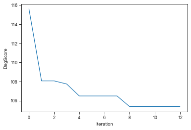
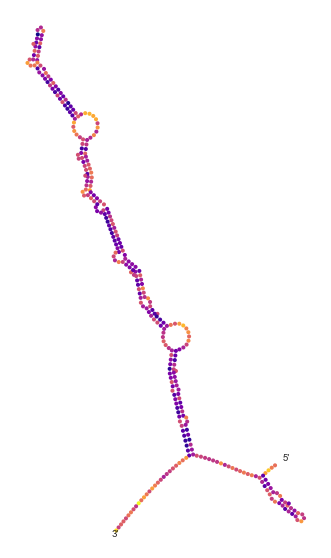

# RiboTree-mRNA

A Monte Carlo Tree Search algorithm to optimize stability of messenger RNA.

Das Lab, 2020

Contributors:

-Christian Choe  
-Hannah Wayment-Steele  
-Do Soon Kim  

If used, please cite: Wayment-Steele, H. K., Kim, D.S., Choe, C. A., Nicol, J. J., Wellington-Oguri, R., Sparberg, R. A. P., Huang, P., & Das, R. (2020). Theoretical basis for stabilizing messenger RNA through secondary structure design. BioRxiv.

## Dependencies

- Ribotree is written in Python 3.
- Arnie (https://www.github.com/DasLab/arnie), which provides wrappers to call folding engines.
- RiboGraphViz(https://www.github.com/DasLab/RiboGraphViz, which calculates secondary structure properties.
- Biopython, which can be installed thorugh `pip install bio`.
- DegScore (https://github.com/eternagame/DegScore)

To check all dependencies are present and correct, run `python test_dependencies.py`. Full example output of a correct pass is provided in `passing_dep_test_output.txt`

This will automatically check:

- ViennaRNA, CONTRAfold, EternaFold, LinearPartition-V/C/E energy models
- Arnie setup
- DegScore
- RiboGraphViz

Passing last line of output: `Congrats! Everything matches`

Not-passing last line of output: `2 discrepancies encountered -- see readout above.`

## Purpose

This package is to optimize an mRNA sequence using a Monte Carlo tree search (MCTS) algorithm. Can be used to optimize the average unpaired probability metric described in the above preprint, other thermodynamic values (dG(MFE), dG(ensemble), and more), as well as structural characteristics (number of hairpins, number of 3-way junctions, and more).

## Example workflow

### Run Ribotree

A minimal input file is provided in `input/example.txt` with simple default settings.

`python ribotree.py --file input/example.txt` will create two output files:

`example_analysis/example.20210618-144823-76459.RUNNING_BEST.txt` contains sequences where the best sequence has been collected every X iterations, determined by the `stride` parameter. All metrics are computed.

`example_analysis/example.20210618-144823-76459.FULL.txt` contains all the sequences accepted in the monte carlo run, as well as the loss function value.

You should look for the DegScore column to decrease over the run.

The run takes about 10 minutes on a MacBook Pro (2.9 GHz Quad-Core Intel Core i7).

### Analyze output

An example jupyter notebook with analysis is in `example_analysis/example_analysis.ipynb`. Useful commands for monitoring DegScore and secondary structures:





Unit tests to check output of Arnie/DegScore utilities is in `example_analysis/arnie_degscore_unit_tests.ipynb`.

## Quickstart

```
# RNA sequence: Multi-epitope vaccine

# RNA sequence to optimize. "G" is just a name for this sequence. Must be a unique single letter.
-domain G MGGSGGSGYQPYRVVVLGGSGGSPYRVVVLSFGGSGGSLSPRWYFYY* aa p
# Format -domain <domain name> <sequence mRNA or amino acid> <type: aa or mrna> <optional flags: pfg>
	# option p: choose codon for mutation based on the probability unpaired
	# option f: choose replacement codon based on probability of codons in humans
	# option g: choose replacement codon based on GC content. Higher GC means codon will more likely be used.

# Optimization criteria:
# first value is the feature, second is to min or maximize, (optional) third is the normalizing value for it.
# mRNA features: degscore dG dGopen mld hp 3wj 4wj 5wj wj hp/3wj bpsum bpunpaired bppaired mcc bpp cai
-condition condition_1 degscore.min
# if you want to specify the normalization value do -condition condition_1 [degscore.min:<value>]

# Extra design options
-allow_nucleotide_repeat True #Setting to true prohibits AAAAA, CCCC, UUUU, and GGGG
-restriction_sites GTGTCGT, AGCUG #prohibit these restriction sites and their reverse complements.

# I/O options
-output ./output
-verbose False

# Temperature (in Kelvin) for accepting move probability. TODO: We need to update this to a non-physical temperature, doesn't make sense for non-dG losses
-T 30

# Folding engine options. Setting -linearfold True speeds up run; requires install of LinearPartition
-package vienna
-linearfold False

# MCTS information

-num_mutate 1
-n_iter 100
-stride 10

# Exploration constant in Upper Confidence Bound 1. Large c favors exploration. c is a float from [0, inf]. If c is < 0 then the code will instead run a linear MCT. Default is -1 (defaults to linear MCTS)
-c_const 1

# Perform beam MCTS. Allows better depth search through beam pruning.
-beam True

# Higher value makes the tree favor depth over breadth search. Default is 1
-scale 10

# max number of children per node.
-n_children 3
```

## Tips

- Try a few c_const values e.g. `-1, 10`
- Try low values of `-T` e.g. `1,0.5,0.1` or even lower.
- Set scale somewhere from [0,10]. e.g. `-scale 10`
- Make sure beam is True. `-beam True`
- Increase the number of children e.g. `-n_children 10`
- Try running with CDSFold integration. More useful if starting from an amino acid sequence.

## Full description of input fields

The input file consists of 6 major components:

1) RNA information
```
-constant_5_prime <string: default ""> RNA sequence that will be appended at the 5' end. Will remain constant through the run.
-constant_3_prime <string: default ""> RNA sequence that will be appended at the 3' end. Will remain constant through the run.
-domain <string: domain name> <string: RNA/amino acid sequence> <string: domain type> <string: domain options>
	# domain name: Name of the domain. Must be single capital letter (e.g. G)
	# RNA/amino acid sequence: Sequence of the domain. Must be either RNA or amino acid. For stop codons use "*"
	# domain types: mRNA, or aa (amino acid)
	# domain options: 
		# p (choose mutation position based on prob(unpaired)
		# f (choose replacement codon based on human codon distribution)
		# g (choose codon replacement codon based on GC content)
		# Note: can combine domain options (e.g. pf)
```
2) conditions
```
-condition condition_1 <criteria>.<max/min>
	# criteria list: degscore dG dGopen mld hp 3wj 4wj 5wj wj hp/3wj bpsum bpunpaired mcc bpp cai
	# See preprint for exact definition of criteria.
```

3) packages
```
-package <string: default ""> RNA folding package to use for evaluation
-linearfold <boolean: default False> Whether to use the linearfold variant of the package
-mod_U <boolean: default False> Whether to mask uracils for degscore. For psuedouracil.
```

4) tree parameters
```
-n_mut <int: default 1> Number of mutations to make per move
-n_iter <int: default 100> # Number of nodes to creates in the MCTS. Equivalent to the number of sequences it accepts in the entire run.
-n_children <int: default 3> # Number of children nodes to create from each parent node
-c_const <float: default -1> # c constant from the UCT1 formula. It controls the depth vs breadth of the tree. If c == -1 then it performs a linear MCTS.
-T <float: default 330.15> # Temperature for the probability of accepting a given move. P(acceptance) = exp( delta Score / (k*T)) ; k = Boltzmann constant
-scale <float: default 1> # scaling factor that affect the final evaluation of each node. Higher value favors depth search.
```
5) extra parameters that affect sequence evaluation
```
-restriction_sites <str: default ""> Comma delimited list of short RNA sequences to avoid. (e.g. -restriction_sites GTGTCGT, AGCUG)
-allow_nucleotide_repeat <bool: default False> # whether to allow for 4 nucleotide repeats. Typically False since nucleotide repeats make synthesis more difficult
-sequence <string: default None> # if flag is given MCTS will not run. Instead this sequence will be evaluated according to the conditions.
-Temp <float: default 37.0> # temperature in Celsius for the RNA folding packages. Does not affect degscore.
-verbose <bool: default False> # whether to print every output from the run
-seed <int: default None> # random seed for rng. Only affects the initial sequence genereation.
```

6) output parameters
```
-output <string: output file location: default "."> # location of where to save all outputs
-stride <int: default 100> # intermittently saves the results of the run after x nodes are created.
-plot <bool: default False> # whether to plot the full MCTS after each step.
```

extra) CDSFold integration
```
-CDSFold_path <str: default None> Path to the executable inside CDSfold src. (e.g. <path>/CDSfold-0.2/src/CDSfold)
-CDSFold_prob <float: default 0> Probability for calling CDSfold as a move in the MCTS. Must be in range [0,1].
See input folder for a commented input file.
```

## Note

If interested in advanced options, such as how to include 5' and 3' UTRs, please reach out to Das Lab (Rhiju Das, rhiju@stanford.edu)
